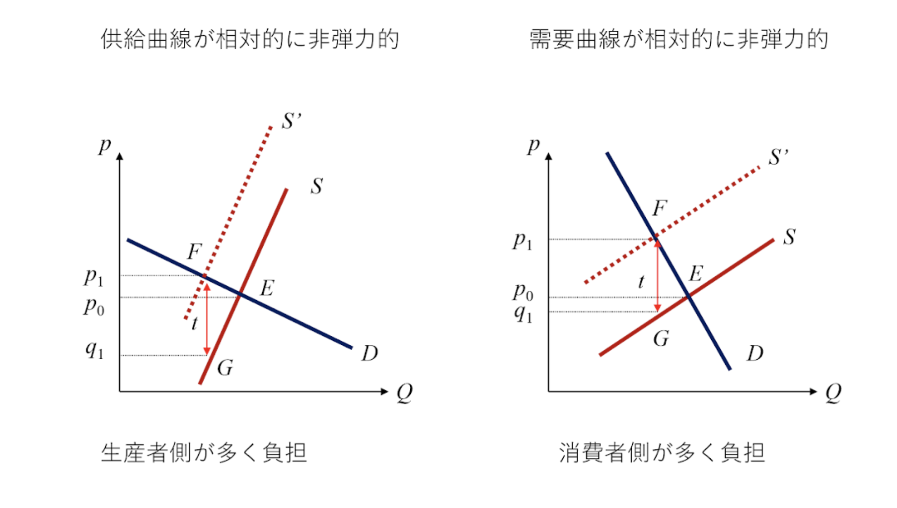

# 2019/07/29/MON 公共経済学対策 要点まとめ

# 1. 国と地方の役割分担

## 政府活動の根拠 (Preface)

市場の失敗への対処と所得の再分配

=> どちらへ任せるべきか

1. 地方政府で対処できないこと
2. 地方政府に任せることの利点

### 公共財の供給

1. 全国公共財 (National Public Goods) => 便益が広く全国に及ぶ
2. 地方公共財 (Local Public Goods) => 便益の及ぶ範囲がある一定の地域にとどまる

ex)
全国公共財 - 国防、外交
地方公共財 - 消防や生活道路

#### 全国的公共財の供給を地方政府に任せることは不合理

#### 地方政府のみの便益を図る行動をとると

全国的公共財は著しい過小供給に陥る

## 地域を超えた外部性への対処

1. 他地域へ正の外部性を与える活動は過小に
2. 他地域へ負の外部性をもたらすような活動は過大に

ex)
社会資本整備や環境対策の効果

=> 当該地域を含むより広い範囲をカバーする政府に任せる

or

補助金による誘導が必要

## 資源配分

居住地や立地の選択に市場の失敗が存在する

=> 資源配分政策は中央政府が行わなければならない

## 所得の再分配

地方政府に任せることは適切でない

### 十分な所得再分配政策は行われなくなる

=> 所得の再分配政策は中央政府が行わなければならない

# 2. 地方税はどうあるべきか

望ましい地方税

公平性・効率性の二つの面

## 公平性の観点から

応益原則に基づくべき

## 効率性の観点から

1. 移動性の低いもの　=> 課税ベースが流出しないように
2. 安定的に税収が得られる
3. 地域間での税収格差が無い

ex) 固定資産税

1. 課税ベースが土地のみ
2. 土地への課税評価額が市場価値を適切に反映している

=> 租税競争や租税輸出へ発展

# 3. 現行の地方税はどうなっている？

## 租税輸出

他地域民へ負担を転嫁

ex) 観光地のホテル入浴税, 天然資源に対する課税

=> 応益原則に反している

地方政府の財政規律が緩い原因

## 租税競争

企業誘致により、最終的に法人税率が０に

国と地方で課税ベースが重複し取り合いに

ゼロサムゲーム囚人のジレンマ（共有地の悲劇）

ex) 所得税

# 4. ティブー(Tiebout)仮説のImplication

*足による投票*の議論

## 前提

- 地方政府がサービスや税負担を提示するとき
- 十分な数の地方政府
- 住民の移動費用等を無視

## Implication

効率的な配分が実現する

## Counter-Argument

### 移動費用

歳をとる＋職業によって高くなる

1. 住民の移動に伴う外部性
2. 十分な数の地方政府の不足
3. 規模の経済性による一極集中と過疎の可能性
=> 他地域からの流入はあり

## その後の議論

### Henry George 定理

最適な地方公共財供給水準＝その土地の地代収入

### Henry George 定理のImplication

地方公共財の財源は地代収入で100%課税で賄うべき
